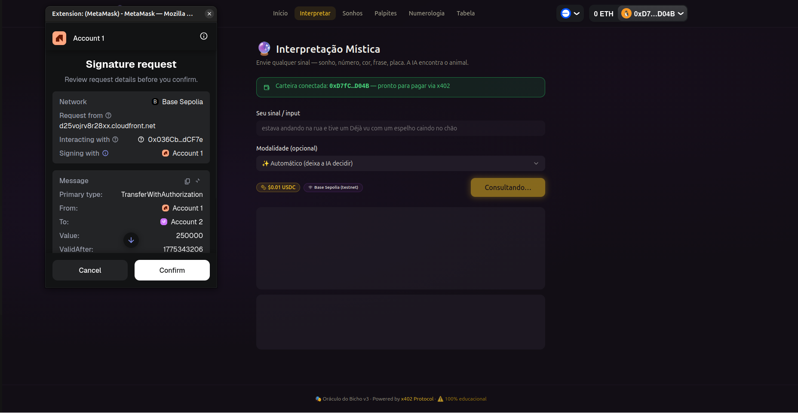
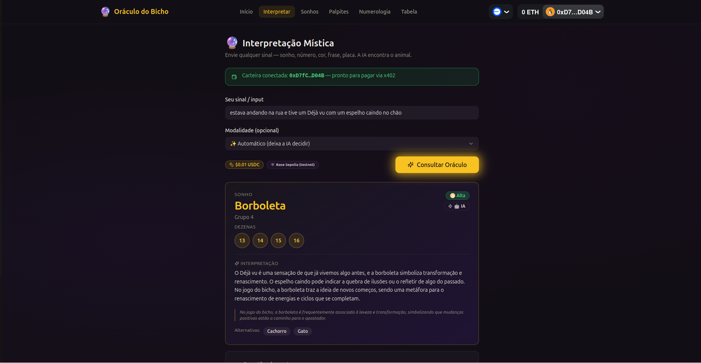
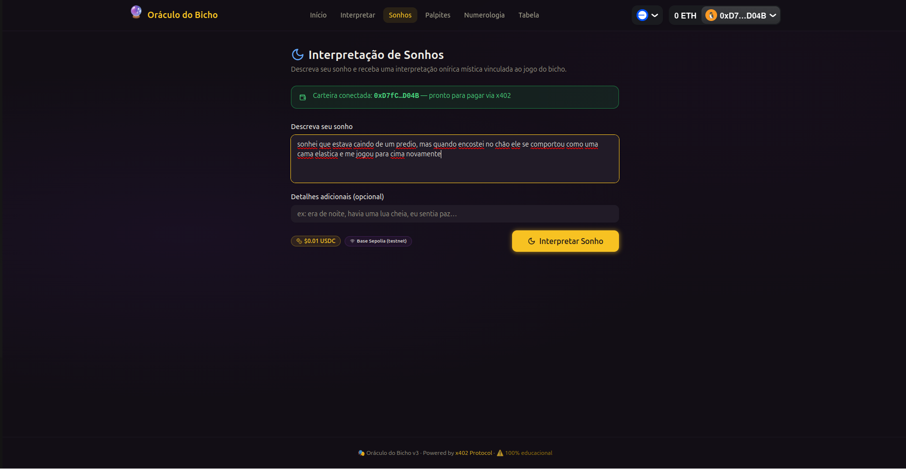
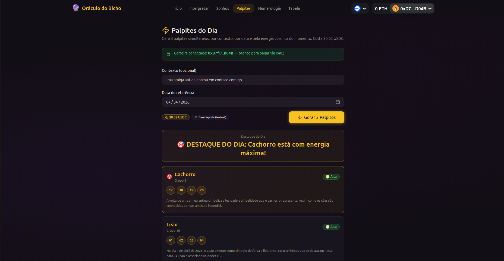
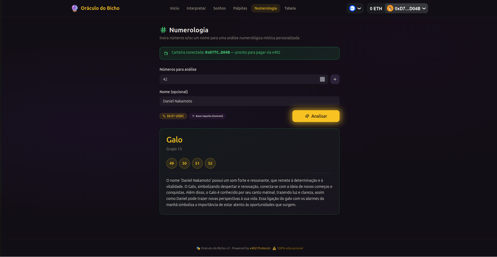
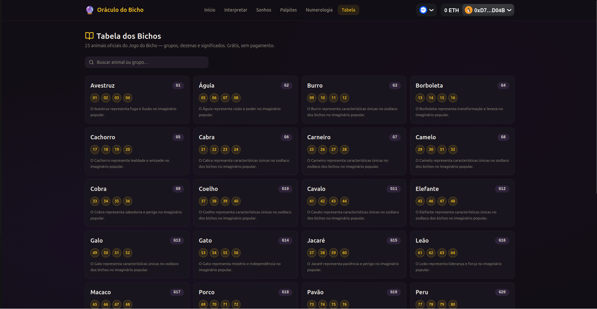
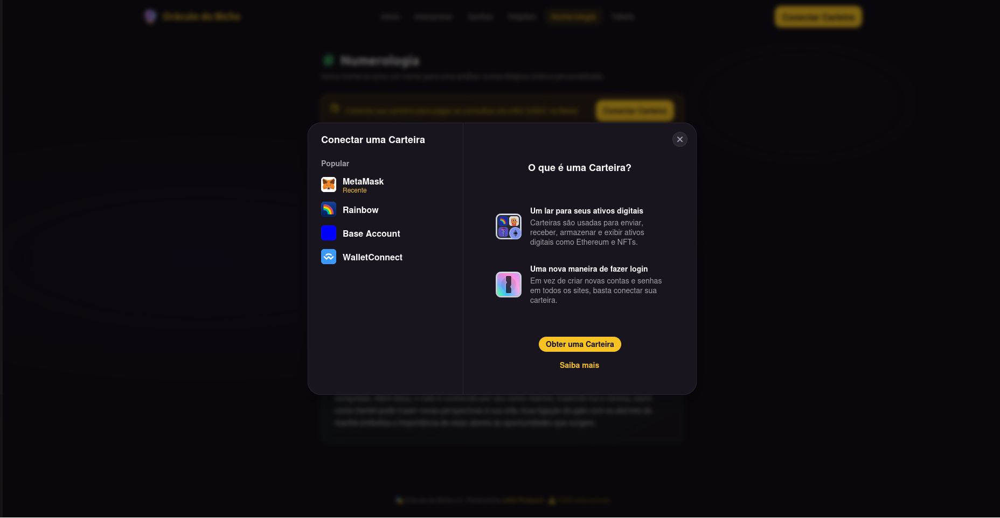

<h1 align="center">
  <br>
  🔮 Oráculo do Bicho
  <br>
</h1>

<p align="center">
  <strong>Interpretações místicas do Jogo do Bicho alimentadas por IA — pagas por consulta via x402 Protocol</strong>
</p>

<p align="center">
  <a href="#-demo">Demo</a> •
  <a href="#-visão-geral">Visão Geral</a> •
  <a href="#-stack">Stack</a> •
  <a href="#-estrutura-do-repositório">Estrutura</a> •
  <a href="#-como-rodar">Como Rodar</a> •
  <a href="#️-deploy-na-aws">Deploy na AWS</a> •
  <a href="#-pagamentos-x402">Pagamentos x402</a> •
  <a href="#-api-reference">API Reference</a> •
  <a href="#-licença">Licença</a>
</p>

<p align="center">
  
  
  
  
  
</p>

---

## 📸 Demo

🌐 **[Acesse a demo ao vivo → (clique aqui)](https://d25vojrv8r28xx.cloudfront.net)**

> Para usar os endpoints pagos você precisa de uma carteira EVM com USDC na rede **Base Sepolia** (testnet):
>
> 1. Instale a [MetaMask](https://metamask.io/download/) ou qualquer carteira compatível com WalletConnect
> 2. Adicione a rede **Base Sepolia** à sua carteira
> 3. Obtenha USDC de teste no [Circle USDC Faucet](https://faucet.circle.com/)

| Home | Interpretar | Resultado |
|------|-------------|-----------|
|  |  |  |

| Sonhos | Palpites | Numerologia |
|--------|----------|-------------|
|  |  |  |

| Tabela dos Bichos | Conectar Wallet  |
|-------------------|------------------|
|  |  |

---

## 🌟 Visão Geral

O **Oráculo do Bicho** é uma aplicação full-stack que combina três tecnologias:

1. **LLM (Gemini / OpenAI)** — gera interpretações místicas criativas para qualquer input do usuário (sonhos, números, cores, placas, frases) e vincula ao universo simbólico dos 25 animais do Jogo do Bicho.

2. **x402 Protocol** — os endpoints de interpretação são **pagos por uso** em USDC na rede Base. O cliente assina uma autorização EIP-3009 com sua carteira, sem gas, e o facilitador liquida a transação on-chain.

3. **shadcn/ui + wagmi** — SPA React com tema místico escuro, componentes de design system open-source, e integração nativa com carteiras EVM via RainbowKit.

> ⚠️ **Aviso**: Projeto 100% educacional. Não incentiva a prática do Jogo do Bicho.

---

## 🛠️ Stack

### Backend (`server/`)
| Tecnologia | Função |
|-----------|--------|
| **Node.js + Express 5** | Servidor HTTP |
| **@x402/express** | Middleware de pagamento x402 |
| **@x402/evm** | Esquema EVM (EIP-3009 / Base) |
| **Gemini API / OpenAI API** | Geração de interpretações via LLM |
| **dotenvx** | Gerenciamento de variáveis de ambiente |

### Frontend (`client/`)
| Tecnologia | Função |
|-----------|--------|
| **React 18 + Vite** | SPA com hot reload |
| **React Router v6** | Roteamento client-side |
| **shadcn/ui** | Design system (Radix UI + Tailwind CSS) |
| **wagmi v2 + RainbowKit v2** | Conexão de carteiras EVM |
| **viem** | Abstração de assinaturas EIP-3009 |
| **@tanstack/react-query** | Cache de estados assíncronos |
| **Tailwind CSS v3** | Estilização utilitária |

---

## 📁 Estrutura do Repositório

```
oraculo-do-bicho/
│
├── server/                        # API Express (backend)
│   ├── index.js                   # Entrypoint + inicialização do servidor
│   ├── package.json
│   ├── .env.example               # Template de variáveis de ambiente
│   └── src/
│       ├── config/
│       │   ├── env.js             # Leitura de variáveis de ambiente
│       │   └── llm.js             # Configuração do provedor LLM
│       ├── data/
│       │   └── tabela.js          # 25 animais, grupos e dezenas oficiais
│       ├── helpers/
│       │   └── mensagens.js       # Significados e mensagens orientadoras
│       ├── middleware/
│       │   └── payment.js         # x402 paymentMiddleware (ExactEvmScheme)
│       ├── routes/
│       │   └── index.js           # Todos os endpoints REST
│       └── services/
│           ├── llmService.js      # Chamadas Gemini / OpenAI + fallback
│           └── promptService.js   # Construção de prompts + emergência
│
├── client/                        # SPA React (frontend)
│   ├── index.html
│   ├── vite.config.js             # Vite + proxy /api → :3001
│   ├── tailwind.config.js         # Tema místico escuro
│   ├── package.json
│   ├── .env.example
│   └── src/
│       ├── main.jsx               # React root + WagmiProvider + RainbowKit
│       ├── App.jsx                # Router + Layout
│       ├── wagmi.js               # Configuração wagmi (Base Sepolia + Base)
│       ├── index.css              # CSS vars (tema escuro) + Tailwind
│       ├── lib/
│       │   ├── constants.js       # URLs, preços x402, redes
│       │   └── utils.js           # cn() helper (clsx + tailwind-merge)
│       ├── hooks/
│       │   └── useX402Fetch.js    # Hook x402: 402 → assina EIP-3009 → retry
│       ├── components/
│       │   ├── Layout.jsx         # Header + nav + footer
│       │   ├── ResultCard.jsx     # Card de resultado de interpretação
│       │   ├── PalpiteCard.jsx    # Card individual de palpite
│       │   ├── PaymentBadge.jsx   # Badge de preço + rede x402
│       │   ├── WalletStatus.jsx   # Status da carteira conectada
│       │   └── ui/                # Componentes shadcn/ui
│       └── pages/
│           ├── Home.jsx           # Landing page com cards dos endpoints
│           ├── Interpretar.jsx    # Formulário: input livre + modalidade
│           ├── Sonho.jsx          # Formulário: sonho + detalhes opcionais
│           ├── Palpite.jsx        # Formulário: contexto + data → 3 palpites
│           ├── Numerologia.jsx    # Formulário: lista de números + nome
│           └── TabelaAnimais.jsx  # Grid dos 25 animais (grátis, sem x402)
│
├── doc/
│   └── spec/
│       └── openapi.yaml           # OpenAPI 3.0.3 com documentação x402
│
├── package.json                   # npm workspaces root
└── README.md
```

---

## 🚀 Como Rodar

### Pré-requisitos

- **Node.js 18+** (necessário para `fetch` global e ESM)
- **npm 8+** (workspaces)
- Uma API key do **Gemini** (grátis) ou **OpenAI**
- Uma carteira EVM para receber pagamentos (opcional — veja abaixo)

### 1. Clone e instale dependências

```bash
git clone https://github.com/seu-usuario/oraculo-do-bicho.git
cd oraculo-do-bicho
npm install --workspaces
```

### 2. Configure o servidor

```bash
cp server/.env.example server/.env
```

Edite `server/.env`:

```env
# LLM — escolha um provedor
LLM_PROVIDER="gemini"
GEMINI_API_KEY="sua-chave-aqui"

# Pagamentos x402 (opcional)
# Deixe em branco para rodar sem pagamentos (modo dev)
EVM_ADDRESS="0xSuaCarteiraAqui"
X402_NETWORK="eip155:84532"          # Base Sepolia (testnet)
PRICE_PER_REQUEST="0.01"             # USD por consulta
```

### 3. Configure o frontend

```bash
cp client/.env.example client/.env
```

Edite `client/.env`:

```env
# Obtenha em https://cloud.walletconnect.com
VITE_WALLETCONNECT_PROJECT_ID="seu-project-id"

# Network (deve coincidir com o servidor)
VITE_X402_NETWORK="eip155:84532"
```

### 4. Rode em desenvolvimento

```bash
# Inicia servidor (:3001) + frontend (:5173) simultaneamente
npm run dev
```

Ou separadamente:

```bash
npm run server:dev   # só o servidor, com --watch
npm run client       # só o frontend Vite
```

### 5. Build de produção

```bash
npm run client:build   # gera client/dist/
npm run server         # inicia servidor em modo produção
```

---

## ☁️ Deploy na AWS

A infraestrutura é gerenciada via **AWS SAM** (template.yml + samconfig.yml) e cria:

| Recurso | Serviço AWS |
|---------|-------------|
| API REST | API Gateway HTTP API (v2) |
| Backend | Lambda (Node.js 24, x86_64) |
| Frontend | S3 (privado) + CloudFront |
| Segredos | SSM Parameter Store (SecureString) |

### Pré-requisitos

- [AWS CLI](https://docs.aws.amazon.com/cli/latest/userguide/getting-started-install.html) configurado (`aws configure`)
- [AWS SAM CLI](https://docs.aws.amazon.com/serverless-application-model/latest/developerguide/install-sam-cli.html)
- [Docker](https://docs.docker.com/get-docker/) (para `sam build --use-container` e `sam local`)
- Node.js 24+

### 1. Crie os segredos no SSM Parameter Store

Estes parâmetros são referenciados pelo `template.yml` e nunca entram no código-fonte.
(TODO: adicionar obs para deixar claro que só precisamos de uma das opçoes (openai|gemini))

```bash
aws ssm put-parameter \
  --name /oraculo-do-bicho/gemini_api_key \
  --value "SUA_CHAVE_GEMINI" \
  --type SecureString

aws ssm put-parameter \
  --name /oraculo-do-bicho/openai_api_key \
  --value "SUA_CHAVE_OPENAI" \
  --type SecureString

# Deixe vazio para desativar pagamentos x402
aws ssm put-parameter \
  --name /oraculo-do-bicho/evm_address \
  --value "0xSuaCarteiraAqui" \
  --type SecureString
```

> Para atualizar um parâmetro existente adicione `--overwrite`.

### 2. Configure as variáveis do cliente

Crie `client/.env.production` com a URL da API (disponível após o primeiro deploy):

```env
VITE_WALLETCONNECT_PROJECT_ID=seu-project-id
VITE_API_URL=https://<api-id>.execute-api.us-east-1.amazonaws.com
VITE_X402_NETWORK=eip155:84532
```

### 3. Build

```bash
# Backend (SAM empacota server/ com suas dependências)
sam build

# Frontend
npm run client:build
```

### 4. Deploy da infraestrutura + backend

```bash
sam deploy
```

O SAM usa as configurações de `samconfig.yml`. Na primeira execução será criado o bucket S3 de artefatos automaticamente (`resolve_s3: true`).

Após o deploy, anote as URLs nos Outputs:

```
Outputs:
  ApiUrl          → https://<id>.execute-api.us-east-1.amazonaws.com/
  FrontendUrl     → https://<id>.cloudfront.net
  FrontendBucketName → oraculo-do-bicho-frontend-<account>-us-east-1
```

### 5. Upload do frontend para o S3

```bash
aws s3 sync client/dist/ \
  s3://$(aws cloudformation describe-stack-resource \
    --stack-name oraculo-do-bicho \
    --logical-resource-id FrontendBucket \
    --query 'StackResourceDetail.PhysicalResourceId' \
    --output text) \
  --delete
```

### 6. Invalide o cache do CloudFront

```bash
DIST_ID=$(aws cloudformation describe-stack-resource \
  --stack-name oraculo-do-bicho \
  --logical-resource-id FrontendDistribution \
  --query 'StackResourceDetail.PhysicalResourceId' \
  --output text)

aws cloudfront create-invalidation \
  --distribution-id "$DIST_ID" \
  --paths '/*'
```

### Desenvolvimento local com SAM

Para testar o Lambda localmente antes de subir:

```bash
# Copie o template de variáveis locais
cp env.local.json.example env.local.json
# Preencha os valores reais em env.local.json (arquivo está no .gitignore)

sam build && sam local start-api --env-vars env.local.json
# API disponível em http://127.0.0.1:3000
```

### Remover toda a infraestrutura

```bash
# Esvazie o bucket antes (o CloudFormation não apaga buckets com objetos)
aws s3 rm s3://oraculo-do-bicho-frontend-<account>-us-east-1 --recursive

sam delete
```

---

## 💳 Pagamentos x402

O projeto implementa o [x402 Protocol](https://docs.x402.org) para cobrança por uso sem conta, sem API key, sem assinatura — apenas USDC e uma carteira.

### Como funciona

```
Navegador                    Servidor                  Facilitador x402
    │                            │                            │
    │─── POST /interpretar ──────▶│                            │
    │                            │                            │
    │◀── 402 ────────────────────│                            │
    │    PAYMENT-REQUIRED:        │                            │
    │    base64(PaymentRequired)  │                            │
    │                            │                            │
    │  [Usuário aprova assinatura │                            │
    │   EIP-3009 na carteira —    │                            │
    │   sem gas, sem tx visível]  │                            │
    │                            │                            │
    │─── POST /interpretar ──────▶│                            │
    │    PAYMENT-SIGNATURE:       │                            │
    │    base64(PaymentPayload)   │─── POST /verify ──────────▶│
    │                            │◀── { isValid: true } ──────│
    │                            │─── POST /settle ──────────▶│
    │                            │◀── { txHash } ─────────────│
    │◀── 200 + resposta ─────────│                            │
    │    PAYMENT-RESPONSE:        │                            │
    │    base64(SettleResponse)   │                            │
```

### Preços por endpoint

| Endpoint | Preço | Rede |
|----------|-------|------|
| `POST /interpretar` | $0.01 USDC | Base Sepolia |
| `POST /sonho` | $0.01 USDC | Base Sepolia |
| `POST /palpite` | $0.02 USDC | Base Sepolia |
| `POST /numerologia` | $0.01 USDC | Base Sepolia |
| `GET /tabela/animais` | Grátis | — |

### Ir para mainnet

1. Mude `X402_NETWORK=eip155:8453` no `server/.env`
2. Mude `FACILITATOR_URL=https://api.cdp.coinbase.com/platform/v2/x402`
3. Mude `VITE_X402_NETWORK=eip155:8453` no `client/.env`
4. Certifique-se que `EVM_ADDRESS` é uma carteira mainnet real

### Desativar pagamentos (dev local)

Deixe `EVM_ADDRESS` vazio em `server/.env`. O middleware x402 não será registrado e todos os endpoints ficam livres.

---

## 📖 API Reference

A especificação completa está em [`doc/spec/openapi.yaml`](doc/spec/openapi.yaml) no formato **OpenAPI 3.0.3**.

Você pode visualizá-la em:
- [Swagger Editor](https://editor.swagger.io) — cole o conteúdo do arquivo
- [Redocly](https://redocly.com/redoc/) — aponta para o arquivo local

### Endpoints resumidos

| Método | Rota | Descrição | Pago |
|--------|------|-----------|------|
| `GET` | `/` | Informações e exemplos | ✗ |
| `GET` | `/health` | Status da API e LLM | ✗ |
| `GET` | `/tabela/animais` | 25 animais com dezenas e significados | ✗ |
| `POST` | `/interpretar` | Interpretação principal — qualquer input | ✓ |
| `POST` | `/sonho` | Especialista em sonhos | ✓ |
| `POST` | `/palpite` | 3 palpites simultâneos (contexto + data + energia) | ✓ |
| `POST` | `/numerologia` | Análise numerológica de números e nomes | ✓ |

### Exemplo rápido (sem pagamentos)

```bash
# Execute o servidor sem EVM_ADDRESS para teste livre
curl -X POST http://localhost:3001/interpretar \
  -H "Content-Type: application/json" \
  -d '{"input": "sonhei com um leão na chuva", "modalidade": "sonho"}'
```

### Exemplo com PAYMENT-SIGNATURE (x402)

```bash
# 1. Primeira chamada — recebe 402
curl -i -X POST http://localhost:3001/interpretar \
  -H "Content-Type: application/json" \
  -d '{"input": "meu número da sorte é 7"}'
# → HTTP/1.1 402  +  PAYMENT-REQUIRED: eyJ4NDAyVmVyc2lvbi...

# 2. Decodifica, assina EIP-3009 com sua carteira
# 3. Reenvia com a assinatura
curl -X POST http://localhost:3001/interpretar \
  -H "Content-Type: application/json" \
  -H "PAYMENT-SIGNATURE: eyJ4NDAyVmVyc2lvbi..." \
  -d '{"input": "meu número da sorte é 7"}'
# → HTTP/1.1 200  +  PAYMENT-RESPONSE: eyJzdWNjZXNz...
```

---

## 🎨 Design System

O frontend utiliza **[shadcn/ui](https://ui.shadcn.com)** — componentes open-source (MIT) construídos sobre Radix UI + Tailwind CSS. Os componentes são copiados para o repositório (`client/src/components/ui/`), sem dependência de lock-in.

### Tema Místico Escuro

O tema foi customizado com uma paleta centrada em:
- **Background**: roxo escuro profundo (`hsl(268 20% 7%)`)
- **Primary / Gold**: dourado místico (`hsl(45 93% 55%)`)
- **Accent**: roxo vibrante (`hsl(278 50% 42%)`)
- **Foreground**: pergaminho quente (`hsl(52 20% 92%)`)

Para customizar, edite as variáveis CSS em [`client/src/index.css`](client/src/index.css).

---

## 🔧 Variáveis de Ambiente

### `server/.env`

| Variável | Padrão | Descrição |
|----------|--------|-----------|
| `PORT` | `3001` | Porta do servidor HTTP |
| `LLM_PROVIDER` | `gemini` | Provedor LLM: `gemini` ou `openai` |
| `GEMINI_API_KEY` | — | API key Gemini (obrigatória se provider=gemini) |
| `OPENAI_API_KEY` | — | API key OpenAI (obrigatória se provider=openai) |
| `LLM_TIMEOUT` | `10000` | Timeout em ms para chamadas ao LLM |
| `EVM_ADDRESS` | — | Carteira para receber pagamentos (deixe vazio para desativar x402) |
| `X402_NETWORK` | `eip155:84532` | Rede CAIP-2 (testnet ou mainnet) |
| `FACILITATOR_URL` | `https://x402.org/facilitator` | URL do facilitador x402 |
| `PRICE_PER_REQUEST` | `0.01` | Preço em USD por consulta |

### `client/.env`

| Variável | Padrão | Descrição |
|----------|--------|-----------|
| `VITE_WALLETCONNECT_PROJECT_ID` | — | Project ID do WalletConnect Cloud |
| `VITE_API_URL` | `""` | URL base da API (vazio = usa proxy Vite `/api`) |
| `VITE_X402_NETWORK` | `eip155:84532` | Rede exibida na UI (deve coincidir com o servidor) |

---

## 🤝 Contribuindo

1. Fork o projeto
2. Crie uma branch: `git checkout -b feature/minha-feature`
3. Commit suas mudanças: `git commit -m 'feat: minha feature'`
4. Push para a branch: `git push origin feature/minha-feature`
5. Abra um Pull Request

---

## 📄 Licença

MIT © [Oráculo do Bicho](LICENSE)

---

<p align="center">
  Feito com 🔮 + ☕ + <a href="https://x402.org">x402 Protocol</a>
</p>